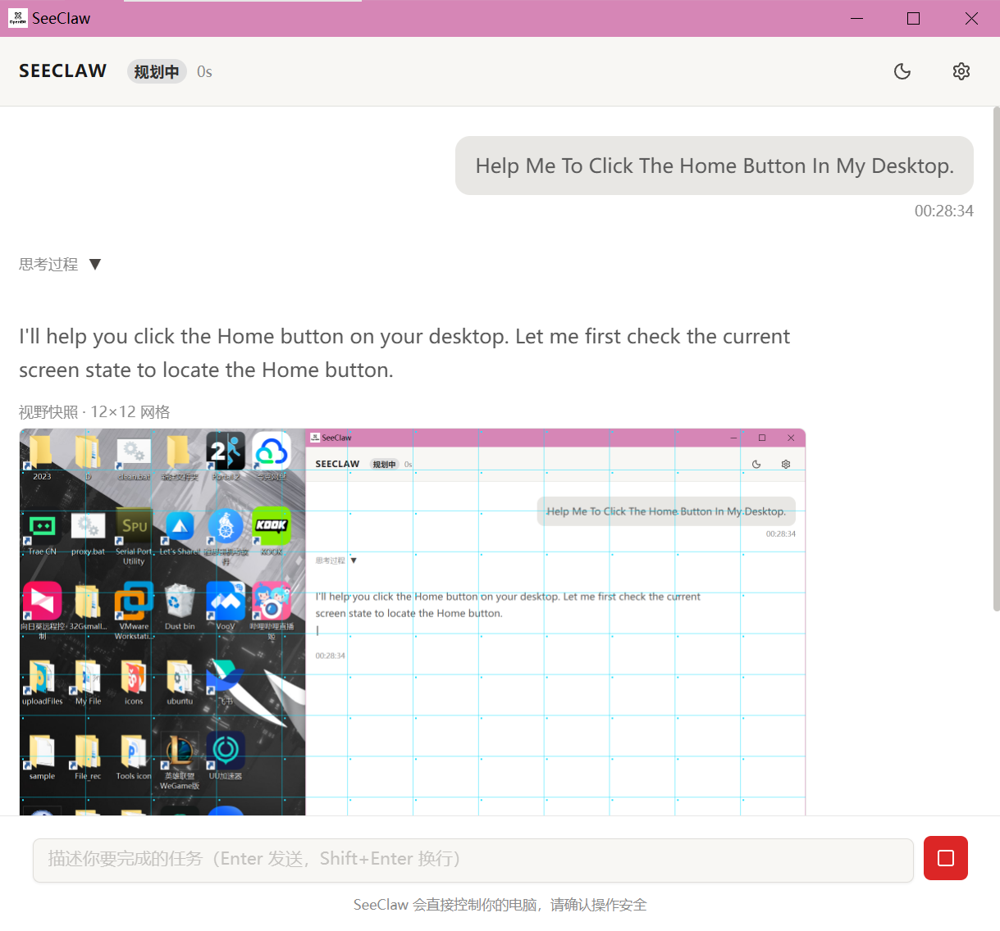
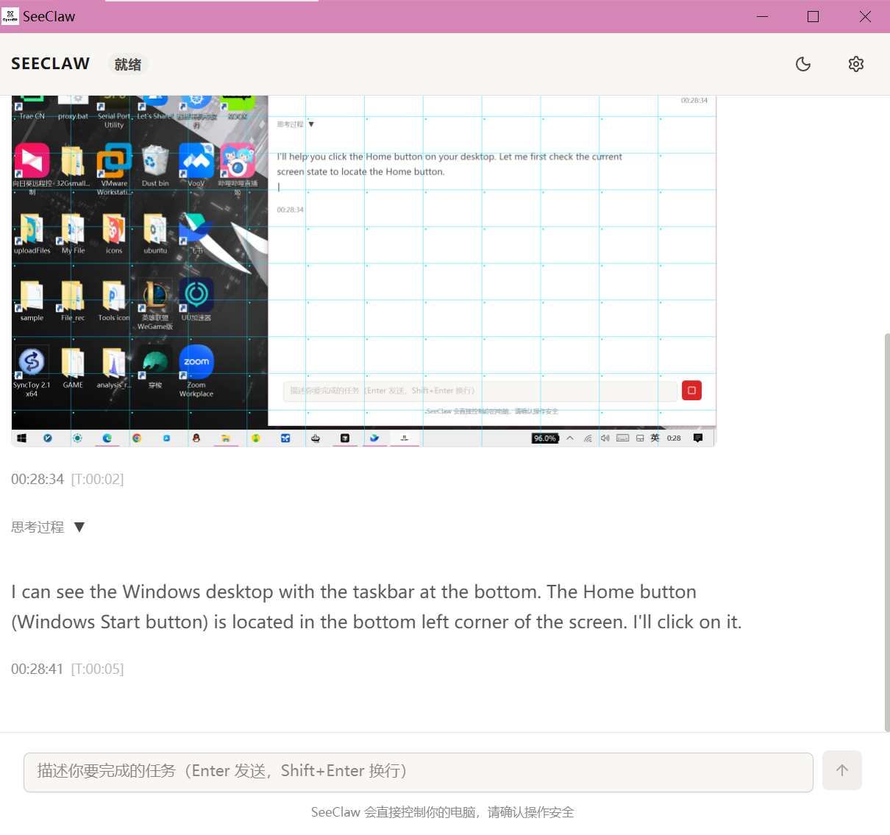

# SeeClaw

**SeeClaw** is an open-source desktop GUI automation agent built with [Tauri 2](https://tauri.app) (Rust backend) and React/TypeScript frontend. It observes your screen, reasons about what it sees, and executes mouse, keyboard, and system actions to accomplish goals described in plain language.

<p align="center">
  
  &nbsp;
  
</p>

---

## How It Works

SeeClaw uses a finite state machine to drive each task:

```
Idle → Routing → Observing → Planning → Executing → Evaluating → Done
```

1. **Observe** — Captures a screenshot; runs ONNX/YOLO element detection or falls back to a SoM (Set-of-Mark) grid overlay for the VLM.
2. **Plan** — Sends the annotated screenshot and goal to a vision-capable LLM, which selects a tool call (click, type, scroll, hotkey, etc.).
3. **Execute** — Dispatches the action via `enigo` (cross-platform mouse/keyboard) or the terminal.
4. **Evaluate** — Re-captures the screen, checks whether the goal is met, and loops or finishes.

High-risk actions (terminal commands, file deletion, MCP calls) are gated behind a **Human-in-the-Loop** approval dialog before execution.

---

## Features

- **Multi-provider LLM routing** — Switch between ZhipuAI GLM, OpenAI, Anthropic Claude, DeepSeek, Qwen, or any OpenAI-compatible endpoint. Each role (`routing`, `chat`, `tools`, `vision`) can be assigned a different provider and model independently.
- **SoM grid fallback** — When ONNX detection returns zero elements, an N×N cyan grid is drawn over the screenshot and the VLM is asked to identify the target cell by label (e.g. `C4`), requiring no pre-trained model for basic tasks.
- **SSE streaming** — LLM responses stream token-by-token to the frontend via Tauri events, including a collapsible reasoning trace panel.
- **Human-in-the-loop** — Any action listed in `config.toml > safety.require_approval_for` triggers an approval card before the agent proceeds.
- **Skill system** — Reusable multi-step action sequences stored as JSON; the agent can invoke them as named tools.
- **MCP support** — Connect Model Context Protocol servers (e.g. filesystem) to extend the agent's toolset.
- **RAG / Experience memory** — Appends successful task summaries for future retrieval.
- **Safety guard** — Configurable limits: disable terminal commands, disable file operations, set max consecutive failure count and max loop duration.
- **Light / Dark theme** — Joy UI neutral dual theme, toggleable from the header.

---

## Tech Stack

| Layer | Technology |
|---|---|
| Desktop shell | Tauri 2 |
| Backend language | Rust (tokio async runtime) |
| Frontend | React 18 + TypeScript + Vite |
| UI components | MUI Joy UI |
| State management | MobX |
| Screen capture | xcap |
| Mouse / keyboard | enigo |
| HTTP / SSE | reqwest + futures-util |
| LLM protocol | OpenAI-compatible Chat Completions API |

---

## Getting Started

### Prerequisites

- [Rust](https://rustup.rs) (stable, 1.77+)
- [Node.js](https://nodejs.org) 18+
- [Tauri CLI v2](https://tauri.app/start/prerequisites/)

### Installation

```bash
git clone https://github.com/OpenBitX/seeclaw.git
cd seeclaw

# Install frontend dependencies
cd src-ui && npm install && cd ..
```

### Configuration

Copy and edit the configuration file:

```bash
cp config.toml.example config.toml   # if an example exists, otherwise edit config.toml directly
```

Set your provider API keys inside `config.toml`:

```toml
[llm.providers.zhipu]
api_base = "https://open.bigmodel.cn/api/paas/v4/chat/completions"
model    = "glm-4-flash"
# api_key = "your_key_here"   # or set via env: ZHIPU_API_KEY

[llm.providers.openai]
api_base = "https://api.openai.com/v1/chat/completions"
model    = "gpt-4o"
# api_key = "your_key_here"
```

API keys can also be provided via environment variables or the in-app Settings panel (the UI redacts stored keys on display).

### Run in Development

```bash
cargo tauri dev
```

### Build for Release

```bash
cargo tauri build
```

The installer is output to `src-tauri/target/release/bundle/`.

---

## Configuration Reference

`config.toml` controls all runtime behavior:

| Section | Key | Description |
|---|---|---|
| `[llm]` | `active_provider` | Default provider ID when no role match is found |
| `[llm.roles]` | `routing`, `chat`, `tools`, `vision` | Per-role provider + model + streaming flag |
| `[llm.providers.*]` | `api_base`, `model`, `temperature`, `api_key` | Provider endpoint definition |
| `[safety]` | `allow_terminal_commands` | Master switch for terminal execution |
| `[safety]` | `require_approval_for` | List of action types requiring user confirmation |
| `[safety]` | `max_consecutive_failures` | Abort the loop after N consecutive errors |
| `[mcp.servers]` | `command`, `args`, `enabled` | MCP server definitions |

---

## Supported Actions

The agent can emit any of the following tool calls:

| Action | Description |
|---|---|
| `mouse_click` | Left-click on a detected UI element |
| `mouse_double_click` | Double-click on an element |
| `mouse_right_click` | Right-click on an element |
| `scroll` | Scroll up / down / left / right |
| `type_text` | Type text (optionally clear field first) |
| `hotkey` | Press a key combination (e.g. `Ctrl+C`) |
| `key_press` | Press a single key |
| `get_viewport` | Capture a fresh screenshot (with optional annotation) |
| `execute_terminal` | Run a shell command (requires approval by default) |
| `mcp_call` | Call a tool on a connected MCP server |
| `invoke_skill` | Run a named reusable skill sequence |
| `wait` | Pause for a specified duration |
| `finish_task` | Signal task completion with a summary |
| `report_failure` | Signal that the goal cannot be achieved |

---

## Project Structure

```
seeclaw/
├── src/                    # Rust backend
│   ├── agent_engine/       # State machine, run loop, history
│   ├── executor/           # Action dispatcher, safety guard, input
│   ├── llm/                # Provider registry, SSE parser, tools
│   ├── mcp/                # MCP client and transport
│   ├── perception/         # Screenshot, ONNX pipeline, SoM grid
│   ├── rag/                # Experience memory and embedder
│   ├── skills/             # Skill loader and types
│   └── config.rs           # AppConfig TOML schema
├── src-ui/                 # React/TypeScript frontend
│   └── src/
│       ├── components/     # Chat, settings, approval card, status
│       ├── store/          # MobX AgentStore, SettingsStore
│       └── types/          # Shared TypeScript types
├── prompts/                # System prompt templates and tool definitions
├── capabilities/           # Capability manifest
├── config.toml             # Runtime configuration
└── Cargo.toml
```

---

## Roadmap

- [ ] ONNX/YOLO element detection pipeline (Phase 4)
- [ ] Full action dispatcher with DPI-aware coordinate mapping (Phase 5)
- [ ] MCP client implementation (Phase 8)
- [ ] RAG experience memory (Phase 9)
- [ ] Windows, macOS, and Linux release bundles

---

## License

MIT — see [LICENSE](LICENSE) for details.
